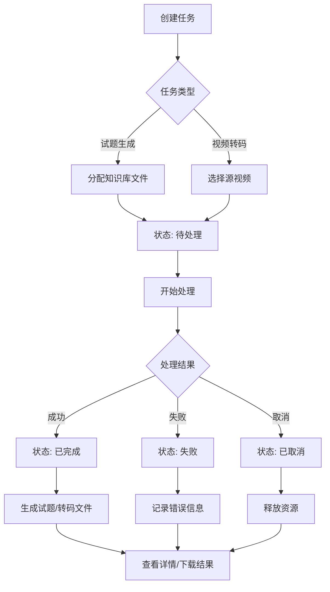

# 任务管理中心

任务管理原型，包含试题生成管理和视频转码管理两个模块。

## 功能模块

### 试题生成管理

管理试题生成任务，支持查看任务状态与结果。

**功能特性：**
- 统计卡片：展示待处理、处理中、已取消、已完成、失败的任务数量
- 任务列表：显示任务ID、试题标题、关联文件、状态、创建时间等信息
- 任务详情弹窗：点击任务可查看详细信息
- 状态下拉框筛选：支持按状态、时间筛选任务
- 分页展示：每页10条，支持翻页浏览

**任务状态：**
- 待处理
- 处理中
- 已完成
- 失败

### 视频转码管理

管理视频转码任务，支持查看转码进度与压缩效果。

**功能特性：**
- 统计卡片：展示各状态任务数量
- 任务列表：显示任务ID、视频标题、状态、进度、原始/转码后大小、压缩比
- 状态下拉框筛选：支持按状态、时间筛选任务

## 业务流程



## 运行项目

```bash
npm i
npm run dev
```
