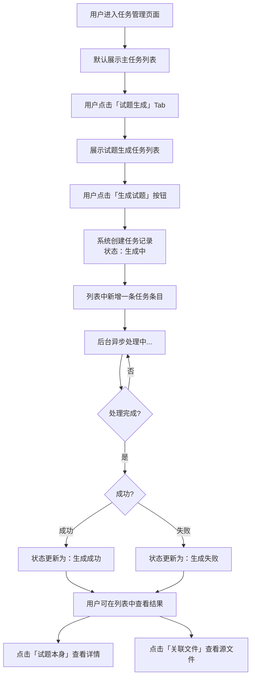

# 任务管理页面扩展方案

|  版本  | 日期        | 作者   | 变更说明 |
|-------|-------------|--------|---------|
| V1.0  | 2026-04-28  | Main   | 初稿发布 |

---

## 一、问题背景

当前信息化系统中，试题生成功能由于涉及多种格式（文档、视频、音频、图片等），生成耗时不固定。供应商以「生成数量不可控」为由，表示进度提示实际价值有限。

**判断：** 进度百分比虽然难以精确，但用户需要一个可感知、可追溯的任务状态反馈机制。

---

## 二、解决方案

### 2.1 核心思路

在现有的**任务管理页面**基础上，通过 Tab 页签形式（如 Excel 多 Sheet）区分不同任务类型，用户点击不同页签即可切换查看对应任务列表。

> **现有任务管理页面（主Tab） + 试题生成（子Tab） + 视频转码（子Tab） + 其他任务（子Tab）**

### 2.2 页面结构

```
┌─────────────────────────────────────────────────────┐
│  任务管理页面                                         │
│                                                     │
│  [主任务列表] [试题生成] [视频转码] [其他任务]  ← Tab切换  │
│                                                     │
│  ┌─────────────────────────────────────────────┐   │
│  │  ID │ 文档 │ 质量 │ 状态 │ 进度 │ 优先级 │ 创建时间 │   │
│  ├─────────────────────────────────────────────┤   │
│  │  ... │ ...  │ ...  │ ...  │ ...  │  ...   │   ...   │   │
│  └─────────────────────────────────────────────┘   │
└─────────────────────────────────────────────────────┘
```

### 2.3 各子Tab任务字段设计

#### 2.3.1 试题生成 Tab

| 字段 | 说明 |
|------|------|
| **序号** | 系统自动分配的递增编号 |
| **试题本身** | 生成后的试题内容，点击可展开查看完整题目列表 |
| **关联文件** | 点击可查看本次生成所依据的源知识库文件清单及说明 |
| **任务创建时间** | 用户触发试题生成的时间点 |
| **结果** | 枚举值：<br>• **生成中** — 后台处理中<br>• **生成成功** — 完成，有输出<br>• **生成失败** — 异常中断 |

#### 2.3.2 视频转码 Tab

（根据实际业务补充字段，如源视频、转码后格式、耗时等）

#### 2.3.3 其他任务 Tab

（用于承载未来新增的异步任务类型，保持扩展性）

---

## 三、交互逻辑



---

## 四、状态说明

| 状态值 | 含义 | 用户感知 |
|--------|------|---------|
| 生成中 | 后台正在处理 | 页面显示「生成中」，无需等待，可离开页面 |
| 生成成功 | 已完成，试题已就绪 | 可点击查看试题内容及关联文件 |
| 生成失败 | 流程异常中断 | 显示失败提示，附错误标识，可联系管理员排查 |

---

## 五、优势总结

1. **统一入口** — 各类任务集中在一个页面，通过 Tab 切换，无需记忆多个页面地址
2. **可追溯** — 每次生成都有记录，关联源文件，随时可查
3. **无压力** — 用户无需盯着进度条等待，可离开页面稍后查看
4. **扩展性强** — 新增任务类型只需新增 Tab，现有架构无需大幅调整
5. **对供应商友好** — 不再要求精确进度，只需回调最终状态

---

## 六、后续建议

1. **失败原因透传** — 建议供应商在「生成失败」时同步写入具体错误信息（如文件格式不支持、内容提取异常等），便于技术支持定位问题
2. **历史记录保留策略** — 建议对「生成成功」的任务保留一定周期（如 30 天），支持用户回溯；失败记录建议长期保留用于分析优化
3. **通知机制（可选）** — 可选增加「生成完成」消息推送（站内信/邮件），减少用户主动刷新页面的成本

---

> **本方案由业务方提出，用于约束供应商实现范围。如有疑问或补充，请联系业务负责人。**
