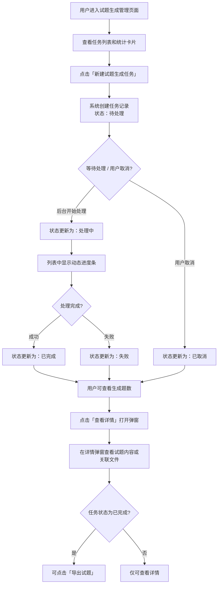

# 试题生成任务监控方案

| 版本 | 日期 | 作者 | 变更说明 |
|------|------|------|----------|
| V1.0 | 2026-04-28 | Main | 初稿发布 |
| V1.1 | 2026-04-28 | Main | 根据原型图更新，补充页面结构、字段设计、交互细节 |

---

## 一、问题背景

当前信息化系统中，试题生成功能由于涉及多种格式（文档、视频、音频、图片等），生成耗时不固定。

**判断：** 进度百分比虽然难以精确，但用户需要一个可感知、可追溯的任务状态反馈机制。

---

## 二、解决方案

### 2.1 核心思路

在现有的**任务管理中心**页面基础上，通过二级 Tab 页签形式区分不同任务类型（类似 Excel 多 Sheet），用户点击不同页签即可切换查看对应任务列表。

> **任务管理中心（顶部Tab） + 试题生成管理（子Tab） + 视频转码管理（子Tab） + 其他任务（子Tab）**

### 2.2 页面结构

```
┌──────────────────────────────────────────────────────────────────────┐
│  任务管理中心                                                          │
├──────────────────────────────────────────────────────────────────────┤
│  [试题生成管理]  [视频转码管理]  [其他任务]  ← 二级Tab切换              │
├──────────────────────────────────────────────────────────────────────┤
│                                                                      │
│  ┌─筛选区域─────────────┐                                           │
│  │ [状态筛选▼] [时间筛选▼] │                                           │
│  └─────────────────────┘                                           │
│                                                                      │
│  ┌─统计卡片区域────────────┐                                          │
│  │ 等待中 │ 生成中 │ 已取消 │ 已完成 │ 失败 │   ← 五色统计卡片           │
│  └─────────────────────┘                                           │
│                                                                      │
│  ┌─任务表格────────────────────────────────────────────────────┐     │
│  │ 序号 │ 任务标题 │ 状态 │ 进度 │ 创建时间 │ 完成时间 │ 生成题数 │ 操作 │     │
│  ├────────────────────────────────────────────────────────────┤     │
│  │ ... │ ...    │ ...  │ ...  │ ...     │ ...     │ ...    │ ...  │     │
│  └────────────────────────────────────────────────────────────┘     │
│                                                                      │
│  ┌─分页──────────────────────────────────────────────────────┐     │
│  │  共N条记录，第 X/Y 页  [首页] [上一页] 1 2 3 4 5 [下一页] [末页] │     │
│  └────────────────────────────────────────────────────────────┘     │
│                                                                      │
└──────────────────────────────────────────────────────────────────────┘
```

### 2.3 任务详情弹窗（点击「查看详情」触发）

```
┌─────────────────────────────────────────────────────────────────┐
│  任务详情                                          [×]           │
├─────────────────────────────────────────────────────────────────┤
│  任务ID: XXXX                                                    │
├─────────────────────────────────────────────────────────────────┤
│  [任务标题]  [任务状态]  [操作用户]  [处理时长]                    │
│  [创建时间]  [完成时间]  [生成数量]                                │
├─────────────────────────────────────────────────────────────────┤
│  [试题内容]  [关联文件 (N)]  ← 内部Tab切换                        │
├─────────────────────────────────────────────────────────────────┤
│                                                                  │
│  （试题内容 / 关联文件列表）                                       │
│                                                                  │
├─────────────────────────────────────────────────────────────────┤
│                                            [关闭] [导出试题]      │
└─────────────────────────────────────────────────────────────────┘
```

---

## 三、试题生成管理 Tab 字段设计

| 字段 | 说明 |
|------|------|
| **序号** | 系统自动分配的递增编号（任务ID） |
| **任务标题** | 点击可打开「任务详情」弹窗查看完整信息 |
| **状态** | 枚举值：<br>• **待处理** — 排队等待<br>• **处理中** — 后台生成中<br>• **已取消** — 用户主动取消<br>• **已完成** — 生成成功<br>• **失败** — 流程异常 |
| **进度** | 进度条可视化：<br>• 待处理：灰色（10%）<br>• 处理中：黄色进度条（动画脉冲，60%）<br>• 已取消：灰色（0%）<br>• 已完成：绿色（100%）<br>• 失败：红色（30%） |
| **创建时间** | 用户触发试题生成的时间点 |
| **完成时间** | 任务完成的时间，完成前显示 "-" |
| **生成题数** | 成功生成的试题数量 |
| **操作** | 「查看详情」按钮，点击打开详情弹窗 |

---

## 四、视频转码管理 Tab 字段设计

| 字段 | 说明 |
|------|------|
| **序号** | 任务ID |
| **任务标题** | 转码任务名称 |
| **状态** | 同试题生成：待处理 / 处理中 / 已取消 / 已完成 / 失败 |
| **进度** | 同试题生成，进度条可视化 |
| **创建时间** | 任务创建时间 |
| **完成时间** | 任务完成时间 |
| **原始大小** | 源视频文件大小（如 1.2GB） |
| **转码后** | 转码后文件大小（如 480MB） |
| **压缩比** | 压缩效率（如 60%） |
| **操作** | 「详情」按钮 |

---

## 五、统计卡片设计

每个 Tab 页面顶部均显示 5 个统计卡片，展示全局任务状态分布：

| 状态 | 颜色 | 说明 |
|------|------|------|
| 等待中 | 灰色（text-gray-600） | 排队待处理的任务数 |
| 生成中 | 黄色（text-yellow-600） | 当前正在处理的任务数 |
| 已取消 | 浅灰（text-gray-500） | 已取消的任务数 |
| 已完成 | 绿色（text-green-600） | 成功完成的任务数 |
| 失败 | 红色（text-red-600） | 处理失败的任务数 |

---

## 六、交互逻辑

### 6.1 任务创建与状态流转



### 6.2 筛选与分页交互

- **状态筛选**：下拉选择「全部状态 / 待处理 / 处理中 / 已取消 / 已完成 / 失败」，筛选后自动重置到第1页
- **时间筛选**：下拉选择「全部时间 / 今天 / 昨天 / 前天」
- **分页**：默认每页10条，支持首页/上一页/页码/下一页/末页切换

---

## 七、状态说明

| 状态值 | 含义 | 用户感知 |
|--------|------|---------|
| 待处理 | 排队等待中 | 灰色进度条，10%进度 |
| 处理中 | 后台正在生成 | 黄色进度条带动画脉冲，60%进度，可离开页面 |
| 已取消 | 用户主动取消 | 灰色进度条，0%进度，任务终止 |
| 已完成 | 生成成功 | 绿色进度条，100%进度，可查看题数和导出 |
| 失败 | 流程异常中断 | 红色进度条，30%进度，显示失败提示 |

---

## 八、任务详情弹窗交互

1. **基本信息区**：显示任务ID、标题、状态、操作用户、处理时长、创建/完成时间、生成数量
2. **内部Tab切换**：
   - **试题内容**：展示生成的题目列表，每题显示题型、难度标签；处理中显示"正在生成试题，请稍候..."；失败显示错误提示
   - **关联文件**：展示本次生成所依据的知识库文件清单
3. **底部操作**：关闭按钮；已完成任务显示「导出试题」按钮

---

## 九、优势总结

1. **统一入口** — 各类任务集中在一个页面，通过 Tab 切换，无需记忆多个页面地址
2. **可追溯** — 每次生成都有记录，关联源文件，随时可查
3. **无压力** — 用户无需盯着进度条等待，可离开页面稍后查看
4. **扩展性强** — 新增任务类型只需新增 Tab，现有架构无需大幅调整
5. **对供应商友好** — 不再要求精确进度，只需回调最终状态

---

## 十、后续建议

1. **失败原因透传** — 建议供应商在「失败」时同步写入具体错误信息（如文件格式不支持、内容提取异常等），便于技术支持定位问题
2. **历史记录保留策略** — 建议对「已完成」的任务保留一定周期（如 30 天），支持用户回溯；失败记录建议长期保留用于分析优化
3. **通知机制（可选）** — 可选增加「生成完成」消息推送（站内信/邮件），减少用户主动刷新页面的成本

---

> **本方案由业务方提出，用于约束供应商实现范围。如有疑问或补充，请联系业务负责人。**
